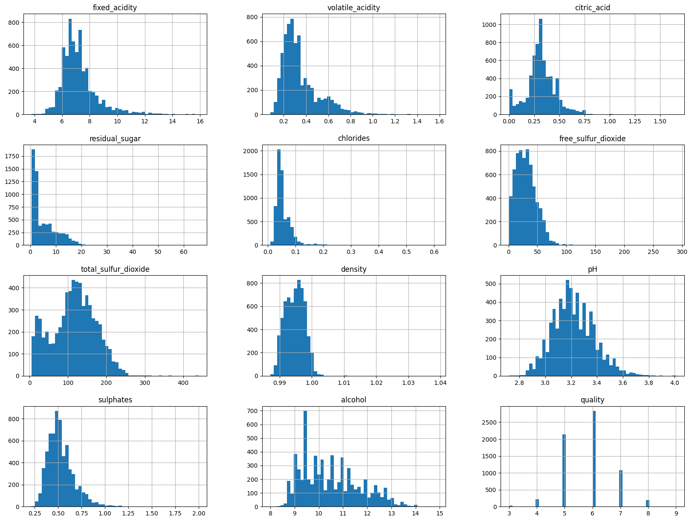
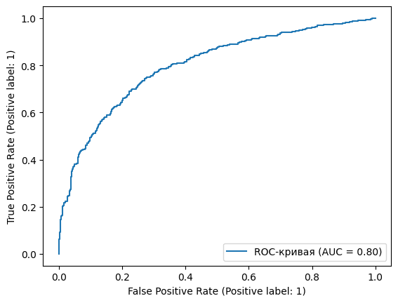
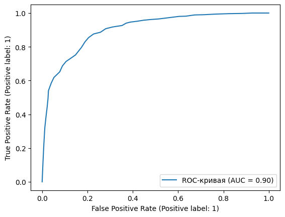
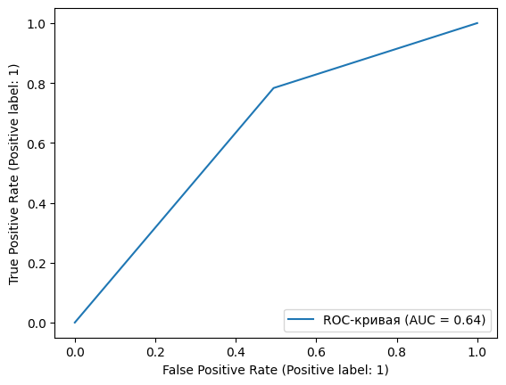
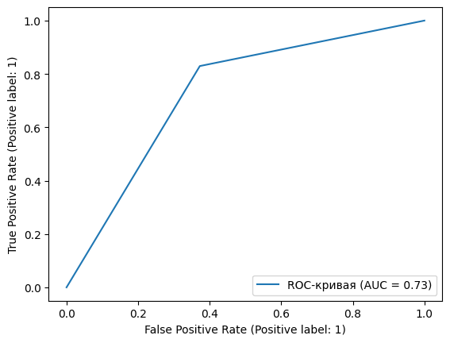

### Добавление и установка необходимых библиотек


```python
pip install pandas
```

    Requirement already satisfied: pandas in c:\users\1dank\pycharmprojects\lab2\venv\lib\site-packages (1.5.2)Note: you may need to restart the kernel to use updated packages.
    
    Requirement already satisfied: pytz>=2020.1 in c:\users\1dank\pycharmprojects\lab2\venv\lib\site-packages (from pandas) (2022.7)
    Requirement already satisfied: numpy>=1.21.0 in c:\users\1dank\pycharmprojects\lab2\venv\lib\site-packages (from pandas) (1.24.0)
    Requirement already satisfied: python-dateutil>=2.8.1 in c:\users\1dank\pycharmprojects\lab2\venv\lib\site-packages (from pandas) (2.8.2)
    Requirement already satisfied: six>=1.5 in c:\users\1dank\pycharmprojects\lab2\venv\lib\site-packages (from python-dateutil>=2.8.1->pandas) (1.16.0)
    


```python
pip install sklearn
```

    Requirement already satisfied: sklearn in c:\users\1dank\pycharmprojects\lab2\venv\lib\site-packages (0.0)
    Requirement already satisfied: scikit-learn in c:\users\1dank\pycharmprojects\lab2\venv\lib\site-packages (from sklearn) (1.2.0)
    Requirement already satisfied: threadpoolctl>=2.0.0 in c:\users\1dank\pycharmprojects\lab2\venv\lib\site-packages (from scikit-learn->sklearn) (3.1.0)
    Requirement already satisfied: numpy>=1.17.3 in c:\users\1dank\pycharmprojects\lab2\venv\lib\site-packages (from scikit-learn->sklearn) (1.24.0)
    Requirement already satisfied: joblib>=1.1.1 in c:\users\1dank\pycharmprojects\lab2\venv\lib\site-packages (from scikit-learn->sklearn) (1.2.0)
    Requirement already satisfied: scipy>=1.3.2 in c:\users\1dank\pycharmprojects\lab2\venv\lib\site-packages (from scikit-learn->sklearn) (1.9.3)
    Note: you may need to restart the kernel to use updated packages.
    


```python
pip install matplotlib
```

    Requirement already satisfied: matplotlib in c:\users\1dank\pycharmprojects\lab2\venv\lib\site-packages (3.6.2)
    Requirement already satisfied: numpy>=1.19 in c:\users\1dank\pycharmprojects\lab2\venv\lib\site-packages (from matplotlib) (1.24.0)
    Requirement already satisfied: pillow>=6.2.0 in c:\users\1dank\pycharmprojects\lab2\venv\lib\site-packages (from matplotlib) (9.3.0)
    Requirement already satisfied: kiwisolver>=1.0.1 in c:\users\1dank\pycharmprojects\lab2\venv\lib\site-packages (from matplotlib) (1.4.4)
    Requirement already satisfied: fonttools>=4.22.0 in c:\users\1dank\pycharmprojects\lab2\venv\lib\site-packages (from matplotlib) (4.38.0)
    Requirement already satisfied: python-dateutil>=2.7 in c:\users\1dank\pycharmprojects\lab2\venv\lib\site-packages (from matplotlib) (2.8.2)
    Requirement already satisfied: packaging>=20.0 in c:\users\1dank\pycharmprojects\lab2\venv\lib\site-packages (from matplotlib) (22.0)
    Requirement already satisfied: contourpy>=1.0.1 in c:\users\1dank\pycharmprojects\lab2\venv\lib\site-packages (from matplotlib) (1.0.6)
    Requirement already satisfied: pyparsing>=2.2.1 in c:\users\1dank\pycharmprojects\lab2\venv\lib\site-packages (from matplotlib) (3.0.9)
    Requirement already satisfied: cycler>=0.10 in c:\users\1dank\pycharmprojects\lab2\venv\lib\site-packages (from matplotlib) (0.11.0)
    Requirement already satisfied: six>=1.5 in c:\users\1dank\pycharmprojects\lab2\venv\lib\site-packages (from python-dateutil>=2.7->matplotlib) (1.16.0)
    Note: you may need to restart the kernel to use updated packages.
    


```python
import pandas as pd
import pickle
from sklearn.pipeline import Pipeline
from sklearn.metrics import classification_report, confusion_matrix
from sklearn.metrics import RocCurveDisplay
from sklearn.model_selection import train_test_split 
from sklearn.impute import SimpleImputer
from sklearn.preprocessing import StandardScaler
from sklearn.model_selection import cross_val_score
from sklearn.linear_model import LinearRegression
from sklearn.ensemble import RandomForestRegressor
from sklearn import svm
from sklearn.naive_bayes import GaussianNB
from sklearn.neighbors import KNeighborsClassifier
from sklearn.model_selection import GridSearchCV
from matplotlib import pyplot as plt
from sklearn.pipeline import Pipeline
from sklearn.preprocessing import StandardScaler
from sklearn.impute import SimpleImputer
from sklearn import svm
import pandas as pd
import numpy as np
from matplotlib import pyplot as plt
```

### Мердж двух таблиц


```python
data = pd.concat([pd.read_csv("datasets/winequality-red.csv"), pd.read_csv("datasets/winequality-white.csv")], ignore_index=True)
```


```python
data
```


<div>
<style scoped>
    .dataframe tbody tr th:only-of-type {
        vertical-align: middle;
    }

    .dataframe tbody tr th {
        vertical-align: top;
    }

    .dataframe thead th {
        text-align: right;
    }
</style>
<table border="1" class="dataframe">
  <thead>
    <tr style="text-align: right;">
      <th></th>
      <th>fixed_acidity</th>
      <th>volatile_acidity</th>
      <th>citric_acid</th>
      <th>residual_sugar</th>
      <th>chlorides</th>
      <th>free_sulfur_dioxide</th>
      <th>total_sulfur_dioxide</th>
      <th>density</th>
      <th>pH</th>
      <th>sulphates</th>
      <th>alcohol</th>
      <th>quality</th>
    </tr>
  </thead>
  <tbody>
    <tr>
      <th>0</th>
      <td>7.4</td>
      <td>0.70</td>
      <td>0.00</td>
      <td>1.9</td>
      <td>0.076</td>
      <td>11.0</td>
      <td>34.0</td>
      <td>0.99780</td>
      <td>3.51</td>
      <td>0.56</td>
      <td>9.4</td>
      <td>5</td>
    </tr>
    <tr>
      <th>1</th>
      <td>7.8</td>
      <td>0.88</td>
      <td>0.00</td>
      <td>2.6</td>
      <td>0.098</td>
      <td>25.0</td>
      <td>67.0</td>
      <td>0.99680</td>
      <td>3.20</td>
      <td>0.68</td>
      <td>9.8</td>
      <td>5</td>
    </tr>
    <tr>
      <th>2</th>
      <td>7.8</td>
      <td>0.76</td>
      <td>0.04</td>
      <td>2.3</td>
      <td>0.092</td>
      <td>15.0</td>
      <td>54.0</td>
      <td>0.99700</td>
      <td>3.26</td>
      <td>0.65</td>
      <td>9.8</td>
      <td>5</td>
    </tr>
    <tr>
      <th>3</th>
      <td>11.2</td>
      <td>0.28</td>
      <td>0.56</td>
      <td>1.9</td>
      <td>0.075</td>
      <td>17.0</td>
      <td>60.0</td>
      <td>0.99800</td>
      <td>3.16</td>
      <td>0.58</td>
      <td>9.8</td>
      <td>6</td>
    </tr>
    <tr>
      <th>4</th>
      <td>7.4</td>
      <td>0.70</td>
      <td>0.00</td>
      <td>1.9</td>
      <td>0.076</td>
      <td>11.0</td>
      <td>34.0</td>
      <td>0.99780</td>
      <td>3.51</td>
      <td>0.56</td>
      <td>9.4</td>
      <td>5</td>
    </tr>
    <tr>
      <th>...</th>
      <td>...</td>
      <td>...</td>
      <td>...</td>
      <td>...</td>
      <td>...</td>
      <td>...</td>
      <td>...</td>
      <td>...</td>
      <td>...</td>
      <td>...</td>
      <td>...</td>
      <td>...</td>
    </tr>
    <tr>
      <th>6492</th>
      <td>6.2</td>
      <td>0.21</td>
      <td>0.29</td>
      <td>1.6</td>
      <td>0.039</td>
      <td>24.0</td>
      <td>92.0</td>
      <td>0.99114</td>
      <td>3.27</td>
      <td>0.50</td>
      <td>11.2</td>
      <td>6</td>
    </tr>
    <tr>
      <th>6493</th>
      <td>6.6</td>
      <td>0.32</td>
      <td>0.36</td>
      <td>8.0</td>
      <td>0.047</td>
      <td>57.0</td>
      <td>168.0</td>
      <td>0.99490</td>
      <td>3.15</td>
      <td>0.46</td>
      <td>9.6</td>
      <td>5</td>
    </tr>
    <tr>
      <th>6494</th>
      <td>6.5</td>
      <td>0.24</td>
      <td>0.19</td>
      <td>1.2</td>
      <td>0.041</td>
      <td>30.0</td>
      <td>111.0</td>
      <td>0.99254</td>
      <td>2.99</td>
      <td>0.46</td>
      <td>9.4</td>
      <td>6</td>
    </tr>
    <tr>
      <th>6495</th>
      <td>5.5</td>
      <td>0.29</td>
      <td>0.30</td>
      <td>1.1</td>
      <td>0.022</td>
      <td>20.0</td>
      <td>110.0</td>
      <td>0.98869</td>
      <td>3.34</td>
      <td>0.38</td>
      <td>12.8</td>
      <td>7</td>
    </tr>
    <tr>
      <th>6496</th>
      <td>6.0</td>
      <td>0.21</td>
      <td>0.38</td>
      <td>0.8</td>
      <td>0.020</td>
      <td>22.0</td>
      <td>98.0</td>
      <td>0.98941</td>
      <td>3.26</td>
      <td>0.32</td>
      <td>11.8</td>
      <td>6</td>
    </tr>
  </tbody>
</table>
<p>6497 rows × 12 columns</p>
</div>


### Проверка целостности данных в таблице


```python
data.info()
```

    <class 'pandas.core.frame.DataFrame'>
    RangeIndex: 6497 entries, 0 to 6496
    Data columns (total 12 columns):
     #   Column                Non-Null Count  Dtype  
    ---  ------                --------------  -----  
     0   fixed_acidity         6497 non-null   float64
     1   volatile_acidity      6497 non-null   float64
     2   citric_acid           6497 non-null   float64
     3   residual_sugar        6497 non-null   float64
     4   chlorides             6497 non-null   float64
     5   free_sulfur_dioxide   6497 non-null   float64
     6   total_sulfur_dioxide  6497 non-null   float64
     7   density               6497 non-null   float64
     8   pH                    6497 non-null   float64
     9   sulphates             6497 non-null   float64
     10  alcohol               6497 non-null   float64
     11  quality               6497 non-null   int64  
    dtypes: float64(11), int64(1)
    memory usage: 609.2 KB
    

### Изучение данных столбца quality


```python
data.quality.value_counts()
```


    6    2836
    5    2138
    7    1079
    4     216
    8     193
    3      30
    9       5
    Name: quality, dtype: int64


```python
data.describe()
```


<div>
<style scoped>
    .dataframe tbody tr th:only-of-type {
        vertical-align: middle;
    }

    .dataframe tbody tr th {
        vertical-align: top;
    }

    .dataframe thead th {
        text-align: right;
    }
</style>
<table border="1" class="dataframe">
  <thead>
    <tr style="text-align: right;">
      <th></th>
      <th>fixed_acidity</th>
      <th>volatile_acidity</th>
      <th>citric_acid</th>
      <th>residual_sugar</th>
      <th>chlorides</th>
      <th>free_sulfur_dioxide</th>
      <th>total_sulfur_dioxide</th>
      <th>density</th>
      <th>pH</th>
      <th>sulphates</th>
      <th>alcohol</th>
      <th>quality</th>
    </tr>
  </thead>
  <tbody>
    <tr>
      <th>count</th>
      <td>6497.000000</td>
      <td>6497.000000</td>
      <td>6497.000000</td>
      <td>6497.000000</td>
      <td>6497.000000</td>
      <td>6497.000000</td>
      <td>6497.000000</td>
      <td>6497.000000</td>
      <td>6497.000000</td>
      <td>6497.000000</td>
      <td>6497.000000</td>
      <td>6497.000000</td>
    </tr>
    <tr>
      <th>mean</th>
      <td>7.215307</td>
      <td>0.339666</td>
      <td>0.318633</td>
      <td>5.443235</td>
      <td>0.056034</td>
      <td>30.525319</td>
      <td>115.744574</td>
      <td>0.994697</td>
      <td>3.218501</td>
      <td>0.531268</td>
      <td>10.491801</td>
      <td>5.818378</td>
    </tr>
    <tr>
      <th>std</th>
      <td>1.296434</td>
      <td>0.164636</td>
      <td>0.145318</td>
      <td>4.757804</td>
      <td>0.035034</td>
      <td>17.749400</td>
      <td>56.521855</td>
      <td>0.002999</td>
      <td>0.160787</td>
      <td>0.148806</td>
      <td>1.192712</td>
      <td>0.873255</td>
    </tr>
    <tr>
      <th>min</th>
      <td>3.800000</td>
      <td>0.080000</td>
      <td>0.000000</td>
      <td>0.600000</td>
      <td>0.009000</td>
      <td>1.000000</td>
      <td>6.000000</td>
      <td>0.987110</td>
      <td>2.720000</td>
      <td>0.220000</td>
      <td>8.000000</td>
      <td>3.000000</td>
    </tr>
    <tr>
      <th>25%</th>
      <td>6.400000</td>
      <td>0.230000</td>
      <td>0.250000</td>
      <td>1.800000</td>
      <td>0.038000</td>
      <td>17.000000</td>
      <td>77.000000</td>
      <td>0.992340</td>
      <td>3.110000</td>
      <td>0.430000</td>
      <td>9.500000</td>
      <td>5.000000</td>
    </tr>
    <tr>
      <th>50%</th>
      <td>7.000000</td>
      <td>0.290000</td>
      <td>0.310000</td>
      <td>3.000000</td>
      <td>0.047000</td>
      <td>29.000000</td>
      <td>118.000000</td>
      <td>0.994890</td>
      <td>3.210000</td>
      <td>0.510000</td>
      <td>10.300000</td>
      <td>6.000000</td>
    </tr>
    <tr>
      <th>75%</th>
      <td>7.700000</td>
      <td>0.400000</td>
      <td>0.390000</td>
      <td>8.100000</td>
      <td>0.065000</td>
      <td>41.000000</td>
      <td>156.000000</td>
      <td>0.996990</td>
      <td>3.320000</td>
      <td>0.600000</td>
      <td>11.300000</td>
      <td>6.000000</td>
    </tr>
    <tr>
      <th>max</th>
      <td>15.900000</td>
      <td>1.580000</td>
      <td>1.660000</td>
      <td>65.800000</td>
      <td>0.611000</td>
      <td>289.000000</td>
      <td>440.000000</td>
      <td>1.038980</td>
      <td>4.010000</td>
      <td>2.000000</td>
      <td>14.900000</td>
      <td>9.000000</td>
    </tr>
  </tbody>
</table>
</div>


```python
%matplotlib inline
```


```python
data.hist(bins=50,figsize=(20,15))
plt.show();
```


    

    


### Вывод min и max значений всех столбцов


```python
print("Alcohol range:", data.alcohol.min(), data.alcohol.max())
print("Sulphates range:", data.sulphates.min(),data.sulphates.max())
print("Residual sugar range:", data.residual_sugar.min(),data.residual_sugar.max() )
print("Fixed acidity range:", data.fixed_acidity.min(),data.fixed_acidity.max() )
print("Volatile acidity range:", data.volatile_acidity.min(),data.volatile_acidity.max() )
print("Citric acid range:", data.citric_acid.min(),data.citric_acid.max() )
print("Chlorides range:", data.chlorides.min(),data.chlorides.max() )
print("Free sulfur dioxide range:", data.free_sulfur_dioxide.min(),data.free_sulfur_dioxide.max() )
print("Density range:", data.density.min(),data.density.max() )
print("PH range:", data.pH.min(),data.pH.max() )
print("Quality range:", data.quality.min(),data.quality.max() )
```

    Alcohol range: 8.0 14.9
    Sulphates range: 0.22 2.0
    Residual sugar range: 0.6 65.8
    Fixed acidity range: 3.8 15.9
    Volatile acidity range: 0.08 1.58
    Citric acid range: 0.0 1.66
    Chlorides range: 0.009 0.611
    Free sulfur dioxide range: 1.0 289.0
    Density range: 0.98711 1.03898
    PH range: 2.72 4.01
    Quality range: 3 9
    

### Создание набора данных для обучения и тестирования


```python
data
```


<div>
<style scoped>
    .dataframe tbody tr th:only-of-type {
        vertical-align: middle;
    }

    .dataframe tbody tr th {
        vertical-align: top;
    }

    .dataframe thead th {
        text-align: right;
    }
</style>
<table border="1" class="dataframe">
  <thead>
    <tr style="text-align: right;">
      <th></th>
      <th>fixed_acidity</th>
      <th>volatile_acidity</th>
      <th>citric_acid</th>
      <th>residual_sugar</th>
      <th>chlorides</th>
      <th>free_sulfur_dioxide</th>
      <th>total_sulfur_dioxide</th>
      <th>density</th>
      <th>pH</th>
      <th>sulphates</th>
      <th>alcohol</th>
      <th>quality</th>
    </tr>
  </thead>
  <tbody>
    <tr>
      <th>0</th>
      <td>7.4</td>
      <td>0.70</td>
      <td>0.00</td>
      <td>1.9</td>
      <td>0.076</td>
      <td>11.0</td>
      <td>34.0</td>
      <td>0.99780</td>
      <td>3.51</td>
      <td>0.56</td>
      <td>9.4</td>
      <td>5</td>
    </tr>
    <tr>
      <th>1</th>
      <td>7.8</td>
      <td>0.88</td>
      <td>0.00</td>
      <td>2.6</td>
      <td>0.098</td>
      <td>25.0</td>
      <td>67.0</td>
      <td>0.99680</td>
      <td>3.20</td>
      <td>0.68</td>
      <td>9.8</td>
      <td>5</td>
    </tr>
    <tr>
      <th>2</th>
      <td>7.8</td>
      <td>0.76</td>
      <td>0.04</td>
      <td>2.3</td>
      <td>0.092</td>
      <td>15.0</td>
      <td>54.0</td>
      <td>0.99700</td>
      <td>3.26</td>
      <td>0.65</td>
      <td>9.8</td>
      <td>5</td>
    </tr>
    <tr>
      <th>3</th>
      <td>11.2</td>
      <td>0.28</td>
      <td>0.56</td>
      <td>1.9</td>
      <td>0.075</td>
      <td>17.0</td>
      <td>60.0</td>
      <td>0.99800</td>
      <td>3.16</td>
      <td>0.58</td>
      <td>9.8</td>
      <td>6</td>
    </tr>
    <tr>
      <th>4</th>
      <td>7.4</td>
      <td>0.70</td>
      <td>0.00</td>
      <td>1.9</td>
      <td>0.076</td>
      <td>11.0</td>
      <td>34.0</td>
      <td>0.99780</td>
      <td>3.51</td>
      <td>0.56</td>
      <td>9.4</td>
      <td>5</td>
    </tr>
    <tr>
      <th>...</th>
      <td>...</td>
      <td>...</td>
      <td>...</td>
      <td>...</td>
      <td>...</td>
      <td>...</td>
      <td>...</td>
      <td>...</td>
      <td>...</td>
      <td>...</td>
      <td>...</td>
      <td>...</td>
    </tr>
    <tr>
      <th>6492</th>
      <td>6.2</td>
      <td>0.21</td>
      <td>0.29</td>
      <td>1.6</td>
      <td>0.039</td>
      <td>24.0</td>
      <td>92.0</td>
      <td>0.99114</td>
      <td>3.27</td>
      <td>0.50</td>
      <td>11.2</td>
      <td>6</td>
    </tr>
    <tr>
      <th>6493</th>
      <td>6.6</td>
      <td>0.32</td>
      <td>0.36</td>
      <td>8.0</td>
      <td>0.047</td>
      <td>57.0</td>
      <td>168.0</td>
      <td>0.99490</td>
      <td>3.15</td>
      <td>0.46</td>
      <td>9.6</td>
      <td>5</td>
    </tr>
    <tr>
      <th>6494</th>
      <td>6.5</td>
      <td>0.24</td>
      <td>0.19</td>
      <td>1.2</td>
      <td>0.041</td>
      <td>30.0</td>
      <td>111.0</td>
      <td>0.99254</td>
      <td>2.99</td>
      <td>0.46</td>
      <td>9.4</td>
      <td>6</td>
    </tr>
    <tr>
      <th>6495</th>
      <td>5.5</td>
      <td>0.29</td>
      <td>0.30</td>
      <td>1.1</td>
      <td>0.022</td>
      <td>20.0</td>
      <td>110.0</td>
      <td>0.98869</td>
      <td>3.34</td>
      <td>0.38</td>
      <td>12.8</td>
      <td>7</td>
    </tr>
    <tr>
      <th>6496</th>
      <td>6.0</td>
      <td>0.21</td>
      <td>0.38</td>
      <td>0.8</td>
      <td>0.020</td>
      <td>22.0</td>
      <td>98.0</td>
      <td>0.98941</td>
      <td>3.26</td>
      <td>0.32</td>
      <td>11.8</td>
      <td>6</td>
    </tr>
  </tbody>
</table>
<p>6497 rows × 12 columns</p>
</div>


### Удаление quality и запись в переменную, с небольшим условием


```python
pipeline = Pipeline([
    ('imputer',SimpleImputer(strategy='median')),
    ('std_scaler', StandardScaler())
])
Y = data.quality.map({3:0,4:0,5:0,6:1,7:1,8:1,9:1})
data = data.drop('quality', axis = 1)
```


```python
data_prepared = pipeline.fit_transform(data)
data_train, data_test, Y_train, Y_test = train_test_split(data_prepared, Y, test_size = 0.20)
```

### Linear Regression


```python
linearRegressor = LinearRegression()
param_grid = [
    {
        'copy_X': [False], 'fit_intercept': [False]
    }, 
    {
        'fit_intercept': [False]
    }
]
grid_search = GridSearchCV(linearRegressor,param_grid=param_grid, cv=5, scoring='neg_mean_squared_error',return_train_score=True)
grid_search.fit(data_train,Y_train)

grid_search.best_params_
```


    {'copy_X': False, 'fit_intercept': False}


```python
linearRegressor = LinearRegression(copy_X=False, fit_intercept=False)
linearRegressor.fit(data_train, Y_train)
Y_pred = linearRegressor.predict(data_test)

file = open('models/linearRegression.pkl', 'wb')
pickle.dump(linearRegressor, file, pickle.HIGHEST_PROTOCOL)
file.close()

file = open('models/BestParamlinearRegression.pkl', 'wb')
pickle.dump(grid_search.best_params_, file, pickle.HIGHEST_PROTOCOL)
file.close()

print("Y:\n", list(Y_test.iloc[:5]))
print("Прогноз Y:\n", list(Y_pred[:5]))
```

    Y:
     [0, 0, 0, 1, 1]
    Прогноз Y:
     [-0.10861329148478194, -0.2783322080278608, -0.10768231503396, -0.014589987602693574, 0.041110577635050216]
    

### Матрица ошибок


```python
print("Матрица ошибок")
print(confusion_matrix(Y_test,Y_pred.round()))
print(classification_report(Y_test,Y_pred.round()))
```

    Матрица ошибок
    [[  0   0   0]
     [ 10 492   0]
     [  5 774  19]]
                  precision    recall  f1-score   support
    
            -1.0       0.00      0.00      0.00         0
             0.0       0.39      0.98      0.56       502
             1.0       1.00      0.02      0.05       798
    
        accuracy                           0.39      1300
       macro avg       0.46      0.33      0.20      1300
    weighted avg       0.76      0.39      0.24      1300
    
    

    c:\users\1dank\pycharmprojects\lab2\venv\lib\site-packages\sklearn\metrics\_classification.py:1344: UndefinedMetricWarning: Recall and F-score are ill-defined and being set to 0.0 in labels with no true samples. Use `zero_division` parameter to control this behavior.
      _warn_prf(average, modifier, msg_start, len(result))
    c:\users\1dank\pycharmprojects\lab2\venv\lib\site-packages\sklearn\metrics\_classification.py:1344: UndefinedMetricWarning: Recall and F-score are ill-defined and being set to 0.0 in labels with no true samples. Use `zero_division` parameter to control this behavior.
      _warn_prf(average, modifier, msg_start, len(result))
    c:\users\1dank\pycharmprojects\lab2\venv\lib\site-packages\sklearn\metrics\_classification.py:1344: UndefinedMetricWarning: Recall and F-score are ill-defined and being set to 0.0 in labels with no true samples. Use `zero_division` parameter to control this behavior.
      _warn_prf(average, modifier, msg_start, len(result))
    


```python
RocCurveDisplay.from_predictions(Y_test, Y_pred, name="ROC-кривая")
```


    <sklearn.metrics._plot.roc_curve.RocCurveDisplay at 0x173d6c1ba30>


    

    


### Random Forest


```python
randomForestRegressor = RandomForestRegressor()
```


```python
randomForestRegressor.get_params()
param_grid = [
    {
        'n_estimators':[4,15,40], 'max_features':[3,5,8]
    }, 
    {
        'bootstrap':[False],'n_estimators':[4,15,40]  
    }
]
grid_search = GridSearchCV(randomForestRegressor,param_grid=param_grid, cv=5, scoring='neg_mean_squared_error',return_train_score=True)
grid_search.fit(data_prepared,Y)

grid_search.best_params_
```


    {'max_features': 3, 'n_estimators': 40}


```python
randomForestRegressor = RandomForestRegressor(max_features=5, n_estimators=40)
randomForestRegressor.fit(data_train, Y_train)
Y_pred = randomForestRegressor.predict(data_test)

file = open('models/randomForest.pkl', 'wb')
pickle.dump(randomForestRegressor, file, pickle.HIGHEST_PROTOCOL)
file.close()

file = open('models/BestParamRandomForest.pkl', 'wb')
pickle.dump(grid_search.best_params_, file, pickle.HIGHEST_PROTOCOL)
file.close()

print("Y:\n", list(Y_test.iloc[:5]))
print("Random Forest прогноз Y:\n", list(Y_pred[:5]))
```

    Y:
     [0, 0, 0, 1, 1]
    Random Forest прогноз Y:
     [0.35, 0.45, 0.275, 0.575, 0.975]
    

### Матрица ошибок


```python
print("Матрица ошибок")
print(confusion_matrix(Y_test,Y_pred.round()))
print(classification_report(Y_test,Y_pred.round()))
```

    Матрица ошибок
    [[373 129]
     [ 91 707]]
                  precision    recall  f1-score   support
    
               0       0.80      0.74      0.77       502
               1       0.85      0.89      0.87       798
    
        accuracy                           0.83      1300
       macro avg       0.82      0.81      0.82      1300
    weighted avg       0.83      0.83      0.83      1300
    
    

### Оценка качества бинарной классификации


```python
RocCurveDisplay.from_predictions(Y_test, Y_pred, name="ROC-кривая")
```


    <sklearn.metrics._plot.roc_curve.RocCurveDisplay at 0x173c23e3a30>


    

    


### Support vector machine


```python
svmRegressor = svm.SVC()
svmRegressor.get_params()
param_grid = [
    {
        'C': [1, 10, 100, 1000], 'kernel': ['linear']
    }, 
    {
        'C': [1, 10, 100, 1000], 'gamma': [0.001, 0.0001], 'kernel': ['rbf'] 
    }
]
grid_search = GridSearchCV(svmRegressor,param_grid=param_grid, cv=5, scoring='neg_mean_squared_error',return_train_score=True)
grid_search.fit(data_prepared,Y)

grid_search.best_params_
```


    {'C': 100, 'gamma': 0.0001, 'kernel': 'rbf'}


```python
svmRegressor = svm.SVC(C=100, gamma=0.001, kernel='rbf')
svmRegressor.fit(data_train, Y_train)
Y_pred = svmRegressor.predict(data_test)

file = open('models/SupportVectorMachine.pkl', 'wb')
pickle.dump(svmRegressor, file, pickle.HIGHEST_PROTOCOL)
file.close()

file = open('models/BestParamSupportVectorMachine.pkl', 'wb')
pickle.dump(grid_search.best_params_, file, pickle.HIGHEST_PROTOCOL)
file.close()

print("Y:\n", list(Y_test.iloc[:5]))
print("Support Vector Machine прогноз Y:\n", list(Y_pred[:5]))
```

    Y:
     [0, 0, 0, 1, 1]
    Support Vector Machine прогноз Y:
     [1, 0, 0, 1, 1]
    

### Матрица ошибок


```python
print("Матрица ошибок")
print(confusion_matrix(Y_test,Y_pred.round()))
print(classification_report(Y_test,Y_pred.round()))
```

    Матрица ошибок
    [[291 211]
     [112 686]]
                  precision    recall  f1-score   support
    
               0       0.72      0.58      0.64       502
               1       0.76      0.86      0.81       798
    
        accuracy                           0.75      1300
       macro avg       0.74      0.72      0.73      1300
    weighted avg       0.75      0.75      0.75      1300
    
    

### Оценка качества бинарной классификации


```python
RocCurveDisplay.from_predictions(Y_test, Y_pred, name="ROC-кривая")
```


    <sklearn.metrics._plot.roc_curve.RocCurveDisplay at 0x173d605b970>


    

    


### Naive Bayes


```python
nBRegressor = GaussianNB()
```


```python
nBRegressor.get_params()
param_grid = [
    {
        'var_smoothing':[0.00000001, 0.000001, 0.001]
    } 
]
grid_search = GridSearchCV(nBRegressor,param_grid=param_grid, cv=5, scoring='neg_mean_squared_error',return_train_score=True)
grid_search.fit(data_prepared,Y)

grid_search.best_params_
```


    {'var_smoothing': 0.001}


```python
nBRegressor = GaussianNB(var_smoothing=1e-08)
nBRegressor.fit(data_train, Y_train)
Y_pred = nBRegressor.predict(data_test)

file = open('models/NaiveBayes.pkl', 'wb')
pickle.dump(nBRegressor, file, pickle.HIGHEST_PROTOCOL)
file.close()

file = open('models/BestParamNaiveBayes.pkl', 'wb')
pickle.dump(grid_search.best_params_, file, pickle.HIGHEST_PROTOCOL)
file.close()

print("Y:\n", list(Y_test.iloc[:5]))
print("Naive Bayes прогноз Y:\n", list(Y_pred[:5]))
```

    Y:
     [0, 0, 0, 1, 1]
    Naive Bayes прогноз Y:
     [0, 0, 0, 1, 1]
    

### Матрица ошибок


```python
print("Матрица ошибок")
print(confusion_matrix(Y_test,Y_pred.round()))
print(classification_report(Y_test,Y_pred.round()))
```

    Матрица ошибок
    [[254 248]
     [173 625]]
                  precision    recall  f1-score   support
    
               0       0.59      0.51      0.55       502
               1       0.72      0.78      0.75       798
    
        accuracy                           0.68      1300
       macro avg       0.66      0.64      0.65      1300
    weighted avg       0.67      0.68      0.67      1300
    
    

### Оценка качества бинарной классификации


```python
RocCurveDisplay.from_predictions(Y_test, Y_pred, name="ROC-кривая")
```


    <sklearn.metrics._plot.roc_curve.RocCurveDisplay at 0x173d612a560>


    

    


### KNN


```python
knnRegressor = KNeighborsClassifier()
```


```python
knnRegressor.get_params()
param_grid = [
    {
        'leaf_size': [10, 15, 20], 'n_neighbors': [3, 5, 7], 'algorithm': ['auto', 'ball_tree', 'kd_tree', 'brute']
    }, 
    {
        'leaf_size': [10, 15, 25], 'n_neighbors': [2, 3, 4], 'algorithm': ['auto', 'ball_tree', 'kd_tree', 'brute']
    } 
]
grid_search = GridSearchCV(knnRegressor,param_grid=param_grid, cv=5, scoring='neg_mean_squared_error',return_train_score=True)
grid_search.fit(data_prepared,Y)

grid_search.best_params_
```


    {'algorithm': 'auto', 'leaf_size': 10, 'n_neighbors': 5}


```python
knnRegressor = KNeighborsClassifier(algorithm='auto', leaf_size=10, n_neighbors=3)
knnRegressor.fit(data_train, Y_train)
Y_pred = knnRegressor.predict(data_test)

file = open('models/KNN.pkl', 'wb')
pickle.dump(knnRegressor, file, pickle.HIGHEST_PROTOCOL)
file.close()

file = open('models/BestParamKNN.pkl', 'wb')
pickle.dump(grid_search.best_params_, file, pickle.HIGHEST_PROTOCOL)
file.close()

print("Y:\n", list(Y_test.iloc[:5]))
print("KNN прогноз Y:\n", list(Y_pred[:5]))
```

    Y:
     [0, 0, 0, 1, 1]
    KNN прогноз Y:
     [1, 1, 0, 1, 1]
    

### Матрица ошибок


```python
print("Матрица ошибок")
print(confusion_matrix(Y_test,Y_pred.round()))
print(classification_report(Y_test,Y_pred.round()))
```

    Матрица ошибок
    [[315 187]
     [136 662]]
                  precision    recall  f1-score   support
    
               0       0.70      0.63      0.66       502
               1       0.78      0.83      0.80       798
    
        accuracy                           0.75      1300
       macro avg       0.74      0.73      0.73      1300
    weighted avg       0.75      0.75      0.75      1300
    
    

### Оценка качества бинарной классификации


```python
RocCurveDisplay.from_predictions(Y_test, Y_pred, name="ROC-кривая")
```


    <sklearn.metrics._plot.roc_curve.RocCurveDisplay at 0x173d61ae8c0>


    

    

